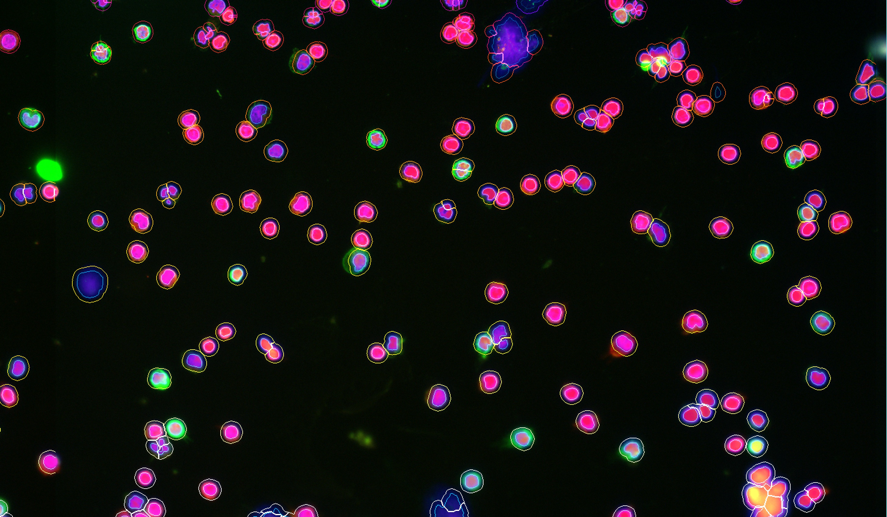
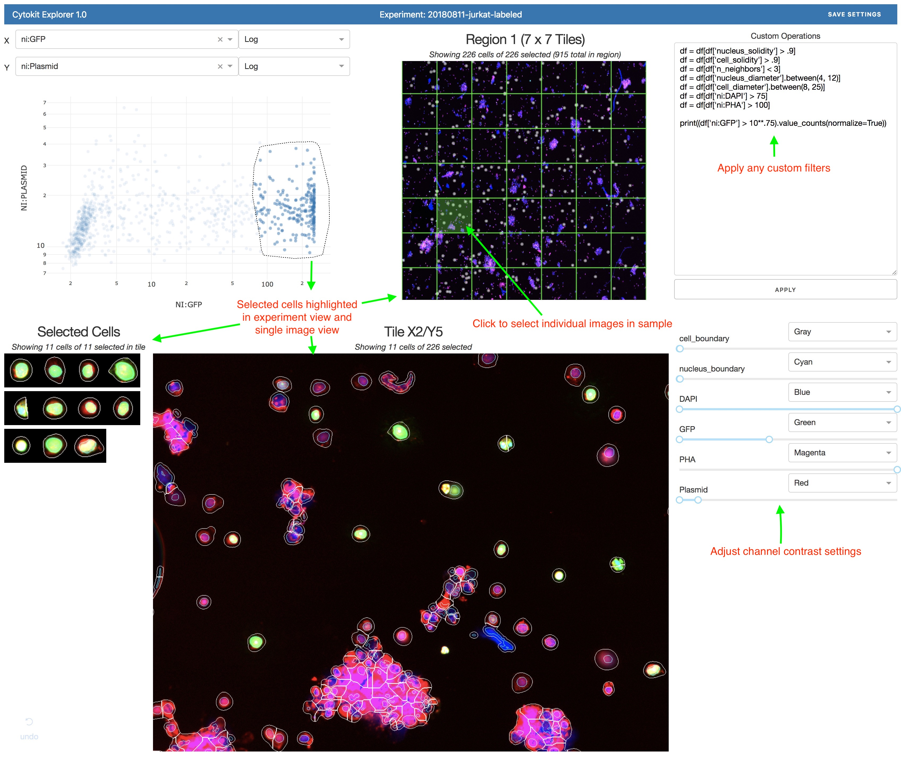

[](https://travis-ci.org/hammerlab/cytokit)
[](https://coveralls.io/github/hammerlab/codex?branch=master)

## Cytokit

Cytokit is a collection of tools for quantifying and analyzing properties of individual cells in large fluorescent microscopy
datasets that are often, but not necessarily, generated from multiplexed staining protocols over many fields of view or time periods.  
As a complement to open source tools like ImageJ and CellProfiler, Cytokit offers much more efficient I/O, memory, and GPU placement 
strategies on top of TensorFlow implementations of common image processing algorithms to improve the proccessing times associated
with 100+ GB experiments.

Image processing operations supported in Cytokit are generally sourced from existing, pre-trained deep learning models or are
at least in part adapted from open source packages to run in a single or multi-GPU environment.  These operations include:

- *Image Registration* - A reference channel (often a nuclear stain) can be used to align multiple images of the same specimen taken in different time periods using a 
GPU-accelerated implementation of [Phase Correlation](https://en.wikipedia.org/wiki/Phase_correlation) for image alignment
- *Deconvolution* - A TensorFlow implementation of Richardson Deconvolution is provided along with a Fast Gibson-Lanni PSF approximation model (see [Flowdec](https://github.com/hammerlab/flowdec))
- *Focus Quality Assessment* - Identifying peaks in focal quality within image volumes is provided using an image classifier designed by [GoogleAi](https://ai.google/) 
(see [Using Deep Learning to Facilitate Scientific Image Analysis](https://ai.googleblog.com/2018/03/using-deep-learning-to-facilitate.html)) 
- *Cell Segmentation* - A deep learning model for nuclei segmentation, first incorporated as a part of CellProfiler 3.0, is used to power localization of fluorescent signals to individual cells (see [CellProfiler 3.0: Next-generation image processing for biology](http://journals.plos.org/plosbiology/article?id=10.1371/journal.pbio.2005970))
- *Illumination Correction* - A fast foreground polynomial illumination function approximation model can be enabled to correct minor lighting variations in both individual images and tiled fields of view (both corrections are modeled simultaneously to capture local and global patterns)

Cytokit pipelines can be configured to use any of the above and produce several types of results for downstream analysis.  These may include user-defined extractions into tiff stacks for visualization, montages of tiled fields of view across any dimensions available in the dataset, or cytometric statistics in FCS or CSV files containing the following information:

- *Cell Positioning* - Spatial x/y/z coordinates as well as tiling and sample coordinates
- *Signal Intensities* - Mean intensities of fluorescent channels localized to both the cell and nucleus 
- *Adjacency Graph* - Identifiers of neighboring cells as well as sizes of shared boundaries (as a percentage of cell perimeter)
- *Cell Morphology* - Size, diameter, solidity, eccentricity, etc.

Additionally, Cytokit offers a UI for quality assurance and high-level analysis with a focus on visualization of the relationships between spatial properties of cells and signal intensities.  See the [Cytokit Explorer](python/applications/cytokit_app/explorer) docs for more details.

Installing and configuring Cytokit currently involves little more than installing [nvidia-docker](https://github.com/nvidia/nvidia-docker/wiki/Installation-(version-2.0)) and building or downloading the Cytokit container image, but this inherently limits support to Linux operating systems only.  Additional limitations of Cytokit include:

- There is currently no CPU-only docker image 
- Algorithms ported to run on TensorFlow graphs nearly all support fewer features than their CPU-only, open source counterparts
- Generating and running pipelines requires working knowledge of JupyterLab and a little tolerance for yaml/json files as well as command lines
- Only tiff files are supported as a raw input image format
- Deconvolution requires manual configuration of microscope attributes like filter wavelengths, immersion media, and numerical aperture (though support to infer much of this based on the imaging platform may be added in the future)
- 3 dimensional inputs are supported but cell segmentation and related outputs are currently 2 dimensional 
- General system requirements include at least 24G RAM and 8G of GPU memory (per GPU)

### Examples 

One of the major goals of Cytokit is to make it as easy as possible to reproduce complicated workflows on big image datasets and to that end, the majority of the logic that
drives how Cytokit functions is determined by json/yaml configurations like this:

```yaml
name: '20180614_TCell_CD4_CD8'
date: '2018-06-14 00:00:00'

# "Acquisition" properties determine the dimensions of the dataset as well as many parameters
# specific to how the images were acquired
acquisition:
  per_cycle_channel_names: [CH1, CH2, CH4]
  channel_names: [DAPI, CD4, CD8]
  emission_wavelengths: [425, 525, 670]
  axial_resolution: 1000.0
  lateral_resolution: 377.442
  magnification: 20
  num_cycles: 1
  num_z_planes: 25
  numerical_aperture: 0.75
  objective_type: air
  region_names: [Region1]
  region_height: 5
  region_width: 5
  tile_height: 1008
  tile_overlap_x: 576
  tile_overlap_y: 432
  tile_width: 1344
  tiling_mode: snake

# "Processor" configuration controls how the core pre-processing and segmentation steps behave
processor:
  best_focus: {channel: DAPI}
  deconvolution: {n_iter: 10, scale_factor: 0.5}
  drift_compensation: {channel: DAPI}
  tile_generator: {raw_file_type: keyence_rgb}
  cytometry: 
    mode: 2D
    nuclei_channel_name: DAPI
    segmentation_params: {proba_threshold: .5, nucleus_dilation: 8}

# "Operator" configurations define "vector-like" transformations of the entire dataset
# and can be used to select relevant subsets or stich partitioned images back together,
# as well as rollup statistics that might have been computed for different dataset partitions
operator:

    # For example, this operation will extract the raw verion of the DAPI channel, the deconvolved/cleanup-version of the same image,
    # and processed versions of the CD4 and CD8 channels as well as labeled cell and nucleus boundary volumes before combining them
    # back together again in a new dataset (and this will all be scoped to only the z-planes assessed to have the best focus)
  - extract:
      name: viz_extract
      channels: ['raw_dapi','proc_dapi','proc_cd4','proc_cd8','cyto_cell_boundary','cyto_nucleus_boundary']
      z: best

  # Next, this step will take all of the newly merged images above and "montage" them together, which in this case means 
  # reconstructing the 5x5 grid of images that were all taken separately with the microscope
  - montage:
      name: viz_extract_montage
      extract_name: viz_extract

# Similarly, "Analysis" operations can do helpful things like run parameterized notebooks that demonstrate how much each tile
# was adjusted during drift compensation or show channel intensity boxplots over the tiles as way to identify over/under exposure
analysis:
  - processor_data_summary 
```

#### CLI

A fairly detailed configuration like the above could be used in conjunction with the CLI to run 
all configured operations:

```bash
export EXPERIMENT_DIR=/data/20180614_TCell_CD4_CD8

# Process the raw data and then create/run configurable visualizations and analyses 
> cytokit processor run \
  --data-dir=$EXPERIMENT_DIR/raw \
  --output-dir=$EXPERIMENT_DIR/output/v1 \
  --config-path=$EXPERIMENT_DIR/config/experiment.yaml \
  --run-drift-comp=False \
  --run-best-focus=True \
  --run-deconvolution=True \
  --gpus=[0,1]
> cytokit operator run_all
> cytokit analysis run_all
```

Or individual extractions and analysis operations could be run as needed:

```bash
# These commands are defined in the configuration but can also be run individually
# for extractions or other operations that don't need to be run constantly

> cytokit operator extract --name='viz_extract' \
  --channels=['raw_dapi','proc_dapi','proc_cd4','proc_cd8','cyto_cell_boundary','cyto_nucleus_boundary']

> cytokit operator montage --name='viz_extract_montage' --extract-name='viz_extract'
  
> cytokit analysis processor_data_summary
```

For the above case specifically, this roughly translates to:
- Load the 25 raw 3D image tiles (on a 5x5 grid), each with dimensions (25, 3, 1008, 1344) in ZCHW format
- Determine the best focal planes, apply deconvolution, crop off overlap, etc.
- Run cell segmentation model to determine cell and nucleus boundaries
- Extract some raw, processed, and segmented data (whatever channels you want) from each tile and put it all in new ones
- Montage all the results together
- Export csvs and fcs files

After that, you could load the 6 channel 5,040 x 6,720 montage image into ImageJ, fiddle with some color/contrast settings on the channels, and then get fairly informative images like this:



*These are mostly isolated t-cells with nuclei and cell borders overlayed on 3 channels:*

- DAPI = Blue
- CD4 = Red
- CD8 = Green

Additionally, stats on those cells and associated signal intensities would be aggregated across the tiles into csv/fcs files like this:

| region_index | tile_index | tile_x | tile_y | id | x                  | y                  | z | cell_size | cell_solidity      | nucleus_size | nucleus_solidity   | ch:DAPI            | ch:CD4             | ch:CD8            | best_z |
|--------------|------------|--------|--------|----|--------------------|--------------------|---|-----------|--------------------|--------------|--------------------|--------------------|--------------------|-------------------|--------|  
| 0            | 0          | 0      | 0      | 1  | 68.501  | 6.014  | 4 | 349       | 0.974 | 99           | 0.980 | 80.406  | 30.555 | 93.871 | 4      | 
| 0            | 0          | 0      | 0      | 2  | 1209.976       | 8.228        | 4 | 512       | 0.967 | 180          | 0.978 | 74.873       | 87.597        | 61.416      | 4      | 
| 0            | 0          | 0      | 0      | 3  | 1224.5             | 0.0                | 4 | 12        | 1.0                | 4            | 1.0                | 73.75              | 82.416  | 64.416 | 4      | 
| 0            | 0          | 0      | 0      | 4  | 1250.303 | 3.296 | 4 | 125       | 0.968 | 21           | 0.954 | 49.608 | 108.024            | 85.336            | 4      | 
| 0            | 0          | 0      | 0      | 5  | 5.986  | 7.618 | 4 | 223       | 0.965 | 72           | 0.935  | 57.309 | 25.008  | 36.686 | 4      | 


### Explorer UI

After processing an experiment, the Explorer UI application can be run within the same docker container
for fast visualization of the relationship between spatial features of cells and fluorescent signal 
intensities:




Some features here include:

- Lasso or box gates on 1 or 2D signals
- Projection of selected cells onto montage images of entire experiments
- Interactive highlighting of cells within individual images 
- Extraction of single cell image patches (matching gates/filters)
- Specification of custom logic for filtering

See the [Cytokit Explorer](python/applications/cytokit_app/explorer/README.md) docs for more examples.
  
### Installation

Cytokit is intended to be run via nvidia-docker + linux only.  More instructions TBD.

#### CODEX Backport

As a small piece of standalone functionality, instructions can be found here for how to
run deconvolution on CODEX samples: [Standalone Deconvolution Instructions](python/standalone/deconvolution)
