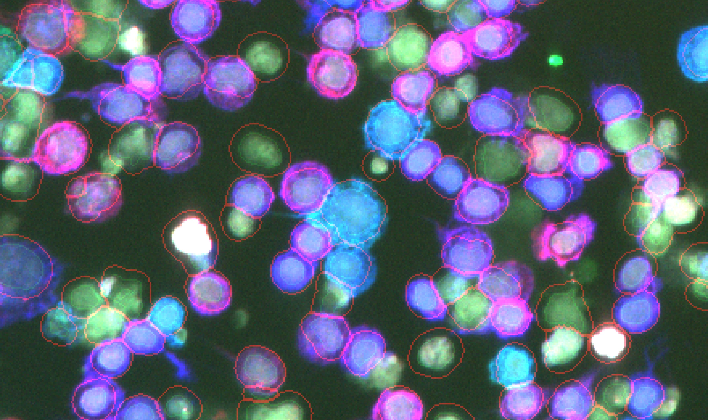

[](https://travis-ci.org/hammerlab/cytokit)
[](https://coveralls.io/github/hammerlab/cytokit)

## Cytokit

Cytokit is a collection of tools for quantifying and analyzing properties of individual cells in large fluorescent microscopy
datasets with a focus on those generated from multiplexed staining protocols.  This includes a GPU-accelerated image processing pipeline (via TensorFlow), CLI tools for batch processing of experimental replicates (often requiring conditional configuration, as things tend go wrong when capturing hundreds of thousands of microscope images over a period of hours or days), and visualization UIs (currently just "Cytokit Explorer").

For more information, see: [Cytokit: A single-cell analysis toolkit for high dimensional fluorescent microscopy imaging](https://www.biorxiv.org/content/early/2018/11/04/460980)
  
  
### Installation and Requirements

Installing and configuring Cytokit currently involves little more than installing [nvidia-docker](https://github.com/nvidia/nvidia-docker/wiki/Installation-(version-2.0)) and building or downloading the Cytokit container image (not on Docker Hub yet), but this inherently limits support to Linux operating systems.  Additional limitations include:

- There is currently no CPU-only docker image 
- Generating and running pipelines requires working knowledge of JupyterLab and a little tolerance for yaml/json files as well as command lines
- Only tiff files are supported as a raw input image format
- Deconvolution requires manual configuration of microscope attributes like filter wavelengths, immersion media, and numerical aperture (though support to infer much of this based on the imaging platform may be added in the future)
- 3 dimensional images are supported but cell segmentation and related outputs are currently 2 dimensional 
- General system requirements include at least 24G RAM and 8G of GPU memory (per GPU)

### Example

One of the goals of Cytokit is to make it as easy as possible to reproduce complicated workflows on big image datasets and to that end, the majority of the logic that drives how Cytokit functions is determined by json/yaml configurations.  Starting from template configurations like this sample [Test Experiment] and more realistically, this [CODEX BALBc1] configuration, pipelines are meant to work as bash scripts executing small variants on these parameterizations for evaluation against one another.  Here is a bash script demonstrating how this often works:

```bash
EXPERIMENT_DATA_DIR=/lab/data/201801-codex-lung

for REPLICATE in "201801-codex-lung-01" "201801-codex-lung-02"; do
    DATA_DIR=$EXPERIMENT_DATA_DIR/$REPLICATE
    
    # This command will generate 3 processing variants to run:
    # v01 - Cell object determined as fixed radius from nuclei
    # v02 - Cell object determined by membrane stain
    # v03 - 5x5 grid subset with deconvolution applied and before/after channels extracted
    cytokit config editor --base-config-path=template_config.yaml --output-dir=$DATA_DIR/output \
      set processor.cytometry.segmentation_params.nucleus_dilation 10 \
    save_variant v01/config reset \
      set processor.cytometry.membrane_channel_name CD45 \
    save_variant v02/config reset \
      set acquisition.region_height 5 \
      set acquisition.region_width 5 \
      set processor.args.run_deconvolution True \
      add operator '{extract: {name:deconvolution, channels:[raw_DAPI,proc_DAPI]}}' \
    save_variant v03/config exit 
    
    # Run everything for each variant of this experiment
    for VARIANT in v01 v02 v03; do
        OUTPUT_DIR=$DATA_DIR/output/$VARIANT
        CONFIG_DIR=$OUTPUT_DIR/config
        cytokit processor run_all --config-path=$CONFIG_DIR --data-dir=$OUTPUT_DIR --output-dir=$OUTPUT_DIR
        cytokit operator run_all  --config-path=$CONFIG_DIR --data-dir=$OUTPUT_DIR 
        cytokit analysis run_all  --config-path=$CONFIG_DIR --data-dir=$OUTPUT_DIR 
    done
done
```

The above, when executed, would produce several things:

1. 5D tiles with processed image data (which can be reused without having to restart from raw data) 
2. 5D tile extracts corresponding to user-defined slices (e.g. raw vs processed DAPI images above) as well as montages of these tiles (e.g. stitchings of 16 2048x2048 images on 4x4 grid into single 8192x8192 images)
3. CSV/FCS files with single-cell data
4. Final yaml configuration files representing how each variant was defined

For example, an ad-hoc extraction like this (which could also be defined in the configuration files):

```bash
cytokit operator extract --name='primary_markers' --z='best' \
  --channels=['proc_dapi','proc_cd3','proc_cd4','proc_cd8','cyto_cell_boundary','cyto_nucleus_boundary']
```

Would produce 5D hyperstack images that could be loaded into ImageJ and blended together:



*Human T Cells stained for DAPI (gray), CD3 (blue), CD4 (red), CD8 (green) and with nucleus outline (light green), cell outline (light red)*

### Cytokit Explorer UI

After processing an experiment, the Explorer UI application can be run within the same docker container
for fast visualization of the relationship between spatial features of cells and fluorescent signal 
intensities:


[High-Res Version](https://storage.googleapis.com/cytokit/docs/images/explorer_screencast_720p.mp4)

See the [Cytokit Explorer](python/applications/cytokit_app/explorer/README.md) docs for more details.

#### CODEX Backport

As a small piece of standalone functionality, instructions can be found here for how to
run deconvolution on CODEX samples: [Standalone Deconvolution Instructions](python/standalone/deconvolution)
