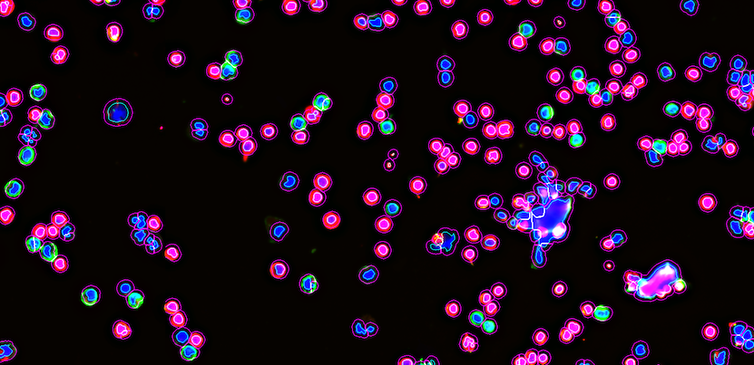

[](https://travis-ci.org/hammerlab/cytokit)
[](https://coveralls.io/github/hammerlab/codex?branch=master)

## Cytokit

Cytokit is an image processing toolkit for analyzing high-dimensional microscopy acquisitions.  The 
majority of the operations provided within Cytokit are intended to run as trained
deep learning models or other computational graphs on top of TensorFlow so as to exploit
GPU acceleration for processing terabyte-sized experiments.  

While intended for large datasets, 
single images or otherwise low-dimensional samples are also supported where any of the following 
common operations could be conducted to capitalize on the freely-available, GPU-based implementations
provided here:

- **Image Registration** - Repeated imaging of cells under different conditions or in different 
time periods can result in sample drift, which can be inverted using a TensorFlow 
implementation of [Phase Correlation](https://en.wikipedia.org/wiki/Phase_correlation) for 
image registration
- **Deconvolution** - Flourescent image blur can be compensated for using a GPU-based implementation
of the [Richardson-Lucy Deconvolution](https://en.wikipedia.org/wiki/Richardson%E2%80%93Lucy_deconvolution) algorithm (provided via [Flowdec](https://github.com/hammerlab/flowdec)).
- **Focal Quality Assessment** - Identifying peaks in focal quality within image volumes is 
provided using an image classifier designed by [GoogleAi](https://ai.google/) 
(see [Using Deep Learning to Facilitate Scientific Image Analysis](https://ai.googleblog.com/2018/03/using-deep-learning-to-facilitate.html)) 
- **Cell Segmentation** - Cytokit includes an application of a Keras-based
U-Net model for nuclei and cell segmentation, as well as attribution of other signals
to those segmented volumes (e.g. quantifying CD4 signals in t-cells identified
by nuclear stains).
- **Cytometric Analysis** - FCS and CSV exports can also be produced by Cytokit to facilitate
analysis in other tools like [FlowJo](https://www.flowjo.com/), [Cytobank](https://www.cytobank.org/), [FCS Express](https://www.denovosoftware.com/site/Flow-RUO-Overview.shtml), etc.    

Cytokit was built initially for processing Keyence images, specifically resulting from the [CODEX](https://www.akoyabio.com/technology/) protocol,
but would support any imaging process that produces tiled images with a specific naming convention.

### Examples 

One of the major goals of Cytokit is to make it as easy as possible to reproduce complicated workflows on big image datasets and to that end, the majority of the logic that
drives how Cytokit functions is determined by json/yaml configurations like this:

```yaml
name: '20180614_TCell_CD4_CD8'
date: '2018-06-14 00:00:00'

# "Acquisition" properties determine the dimensions of the dataset as well as many parameters
# specific to how the images were acquired
acquisition:
  per_cycle_channel_names: [CH1, CH2, CH4]
  channel_names: [DAPI, CD4, CD8]
  emission_wavelengths: [425, 525, 670]
  axial_resolution: 1000.0
  lateral_resolution: 377.442
  magnification: 20
  num_cycles: 1
  num_z_planes: 25
  numerical_aperture: 0.75
  objective_type: air
  region_names: [Region1]
  region_height: 5
  region_width: 5
  tile_height: 1008
  tile_overlap_x: 576
  tile_overlap_y: 432
  tile_width: 1344
  tiling_mode: snake

# "Processor" configuration controls how the core pre-processing and segmentation steps behave
processor:
  best_focus: {channel: DAPI}
  deconvolution: {n_iter: 10, scale_factor: 0.5}
  drift_compensation: {channel: DAPI}
  tile_generator: {raw_file_type: keyence_rgb}
  cytometry: 
    mode: 2D
    nuclei_channel_name: DAPI
    segmentation_params: {proba_threshold: .5, nucleus_dilation: 8}

# "Operator" configurations define "vector-like" transformations of the entire dataset
# and can be used to select relevant subsets or stich partitioned images back together,
# as well as rollup statistics that might have been computed for different dataset partitions
operator:

    # For example, this operation will extract the raw verion of the DAPI channel, the deconvolved/cleanup-version of the same image,
    # and processed versions of the CD4 and CD8 channels as well as labeled cell and nucleus boundary volumes before combining them
    # back together again in a new dataset (and this will all be scoped to only the z-planes assessed to have the best focus)
  - extract:
      name: viz_extract
      channels: ['raw_dapi','proc_dapi','proc_cd4','proc_cd8','cyto_cell_boundary','cyto_nucleus_boundary']
      z: best

  # Next, this step will take all of the newly merged images above and "montage" them together, which in this case means 
  # reconstructing the 5x5 grid of images that were all taken separately with the microscope
  - montage:
      name: viz_extract_montage
      extract_name: viz_extract

# Similarly, "Analysis" operations can do helpful things like run parameterized notebooks that demonstrate how much each tile
# was adjusted during drift compensation or show channel intensity boxplots over the tiles as way to identify over/under exposure
analysis:
  - processor_data_summary 
```

#### Operation Composition

A fairly detailed configuration like the above could be used in conjunction with the CLI to run all configured operations or they can also be run in more composable, ad-hoc ways like this (based on [Python-Fire](https://github.com/google/python-fire)) :

```bash
export EXPERIMENT_DIR=/data/20180614_TCell_CD4_CD8

# Pre-process, create visualization, and export cytometry stats
> cytokit processor run \
  --data-dir=$EXPERIMENT_DIR/raw \
  --output-dir=$EXPERIMENT_DIR/output/v1 \
  --config-path=$EXPERIMENT_DIR/config/experiment.yaml \
  --run-drift-comp=False \
  --run-best-focus=True \
  --run-deconvolution=True \
  --gpus=[0,1] - \
operator extract \
  --name='viz_extract' \
  --channels=['raw_dapi','proc_dapi','proc_cd4','proc_cd8','cyto_cell_boundary','cyto_nucleus_boundary'] - \
operator montage \
  --name='viz_extract_montage' \
  --extract-name='viz_extract' - \
analysis aggregate_cytometry_statistics \
  --mode='best_z_plane'
```

For the above case specifically, this roughly translates to:
- Load the 25 raw 3D image tiles (on a 5x5 grid), each with dimensions (25, 3, 1008, 1344) in ZCHW format
- Determine the best focal planes, apply deconvolution, crop off overlap, etc.
- Run cell segmentation model to determine cell and nucleus boundaries
- Extract some raw, processed, and segmented data (whatever channels you want) from each tile and put it all in new ones
- Montage all the results together
- Export csvs and fcs

After that, you could load the 6 channel 5,040 x 6,720 montage image into ImageJ, fiddle with some color/contrast settings on the channels, and then get fairly informative images like this:



*These are mostly isolated t-cells with nuclei and cell borders overlayed on 3 channels:*

- DAPI = Blue
- CD4 = Red
- CD8 = Green

Additionally, stats on those cells and associated signal intensities would be aggregated across the tiles into csv/fcs files like this:

| region_index | tile_index | tile_x | tile_y | id | x                  | y                  | z | cell_size | cell_solidity      | nucleus_size | nucleus_solidity   | ch:DAPI            | ch:CD4             | ch:CD8            | best_z |
|--------------|------------|--------|--------|----|--------------------|--------------------|---|-----------|--------------------|--------------|--------------------|--------------------|--------------------|-------------------|--------|  
| 0            | 0          | 0      | 0      | 1  | 68.501  | 6.014  | 4 | 349       | 0.974 | 99           | 0.980 | 80.406  | 30.555 | 93.871 | 4      | 
| 0            | 0          | 0      | 0      | 2  | 1209.976       | 8.228        | 4 | 512       | 0.967 | 180          | 0.978 | 74.873       | 87.597        | 61.416      | 4      | 
| 0            | 0          | 0      | 0      | 3  | 1224.5             | 0.0                | 4 | 12        | 1.0                | 4            | 1.0                | 73.75              | 82.416  | 64.416 | 4      | 
| 0            | 0          | 0      | 0      | 4  | 1250.303 | 3.296 | 4 | 125       | 0.968 | 21           | 0.954 | 49.608 | 108.024            | 85.336            | 4      | 
| 0            | 0          | 0      | 0      | 5  | 5.986  | 7.618 | 4 | 223       | 0.965 | 72           | 0.935  | 57.309 | 25.008  | 36.686 | 4      | 


### Installation

Cytokit is intended to be run via nvidia-docker + linux only.  More instructions TBD.

#### CODEX Backport

As a small piece of standalone functionality, instructions can be found here for how to
run deconvolution on CODEX samples: [Standalone Deconvolution Instructions](python/standalone/deconvolution)
