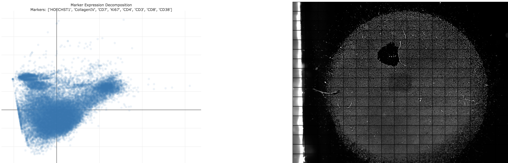
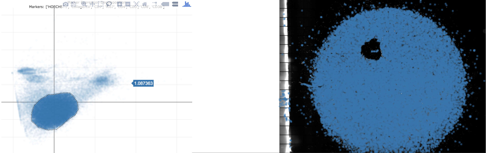

# Decomposition App 

The purpose of this application is to first decompose the expression data for an experiment across many 
channels and then visualize that data mapped back on to the entire sample.

Examples:

