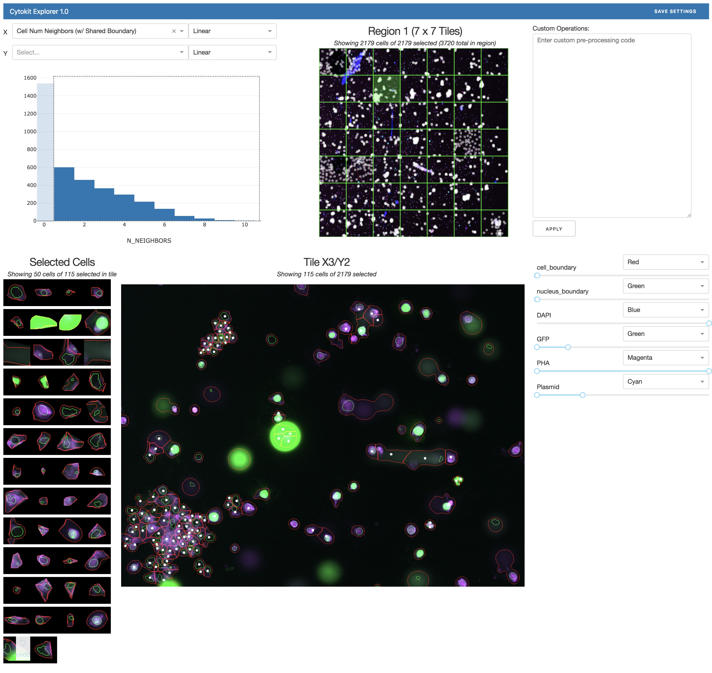
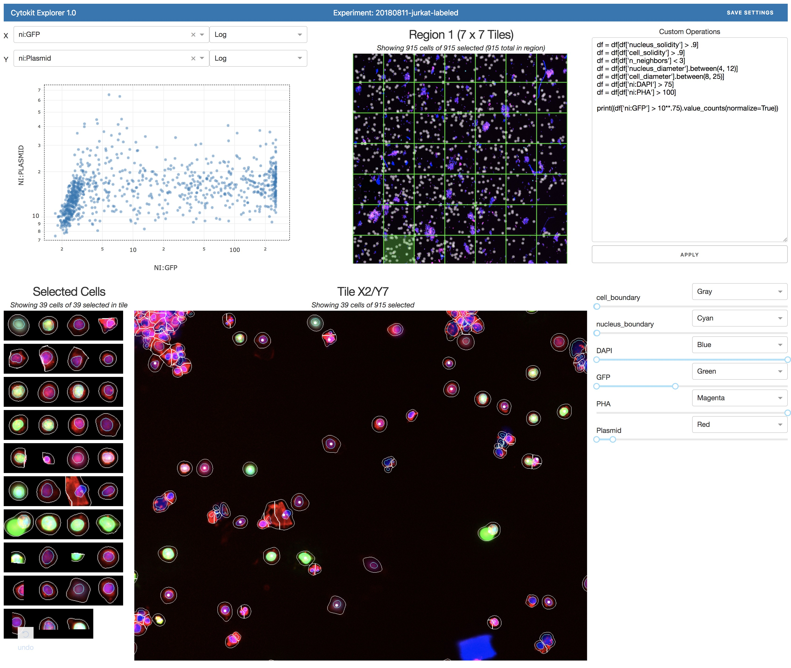

# Cytokit Explorer

The purpose of this application is to provide some high-level analysis of a sample through 
filtering operations on cell subsets.  This is most helpful for identifying unexpected global patterns, 
checking segmentation accuracy, or informing a more programmatic analysis.

As a [Dash](https://plot.ly/products/dash/) application, it can support visualization of tens of 
thousands of cells with little latency, a noticable latency with hundreds of thousands of cells, and
is inoperable with millions of cells (though configurable sampling rates are provided to ensure
that everything is fairly snappy by default).

Configuration for the app currently involves setting environment variables, with at least values for the following variables set:

```bash
export APP_EXP_NAME="20180101_codex_spleen"
export APP_EXP_DATA_DIR=/lab/data/20180101_codex_spleen/output/v01
export APP_EXP_CONFIG_PATH=/lab/data/20180101_codex_spleen/output/v01/config
```

See [config.py](https://github.com/hammerlab/cytokit/blob/54d56880413f1a89000056a1f2b9af1c590cf43e/python/applications/cytokit_app/explorer/config.py) for some other properties

## Running the Application

To run the application, a common pattern is to source an environment variable file before invoking the app through the CLI, e.g.:

```bash
source $MY_ANALYSIS_REPO_DIR/my-experiment/explorer_config.sh
cytokit application run_explorer
```

An example environment variable configuration file can be found at [pub/analysis/codex-spleen/explorer_config.sh](../../../../pub/analysis/codex-spleen/explorer_config.sh) which demonstrates the Explorer app properties relevant to analyzing a CODEX sample.

## Adding Custom Metrics

To add custom metrics for visualization in Explorer, a snippet like this may be used in the top-level bash script:

```bash
DATA_DIR=/path/to/raw/data
OUTPUT_DIR=/path/to/output
CONFIG_DIR=/path/to/config

# Run pipeline to produce csv and image data used by Explorer
cytokit processor run_all --config-path=$CONFIG_DIR --data-dir=$DATA_DIR --output-dir=$OUTPUT_DIR
cytokit operator run_all  --config-path=$CONFIG_DIR --data-dir=$OUTPUT_DIR 
cytokit analysis run_all  --config-path=$CONFIG_DIR --data-dir=$OUTPUT_DIR 

# Add custom fields to csv
cat <<-EOF | python
import pandas as pd
df = pd.read_csv('$OUTPUT_DIR/cytometry/data.csv')
# Add field containing ratio of cell diameter to nucleus diameter
df['cm:diameter_ratio'] = df['cm:diameter'] / df['nm:diameter']
df.to_csv('$OUTPUT_DIR/cytometry/data.csv')
EOF

# Launch the application, which will now make the new diameter ratio metric available
source /path/to/explorer/config; cytokit application run_explorer
```
    
### Examples

#### Example 1: GFP Positive Jurkat Cells

This screenshot shows how GFP positive cells can be identified in a sample after applying a variety of custom 
filters:


#### Example 2: Isolating Unwanted Cells

This example shows a sample where the cell preparation resulted in a clumping of many of the cells in a way 
that interfered with the target fluorescent dye measurements.  The selected cells here are restricted to 
those that directly contact at least one other cell (n_neighbors >= 1) and you can see how this is reflected 
in the images as highlights/dots on cells in clumps of some kind:




#### Example 3: Visualizing All Cells

This example simply shows all cells after applying custom filters, which is often a good way to see if 
there are any more filters worth applying through exploration of individual images and single cell
image patch extractions:


